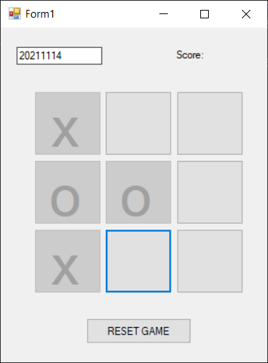
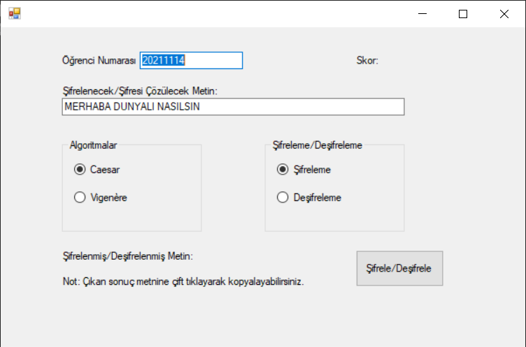
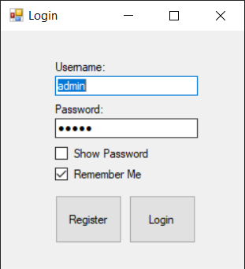

# C# Lab
###### C# Windows Form Labs using .NET Framework

These projects include different widgets and tools of Windows Forms, with a properly working interfaces. Such as an unbeatable XOX game with MiniMax algorithm, Text Ciphering Tool, Register and Login Screen with File I/O.

 

